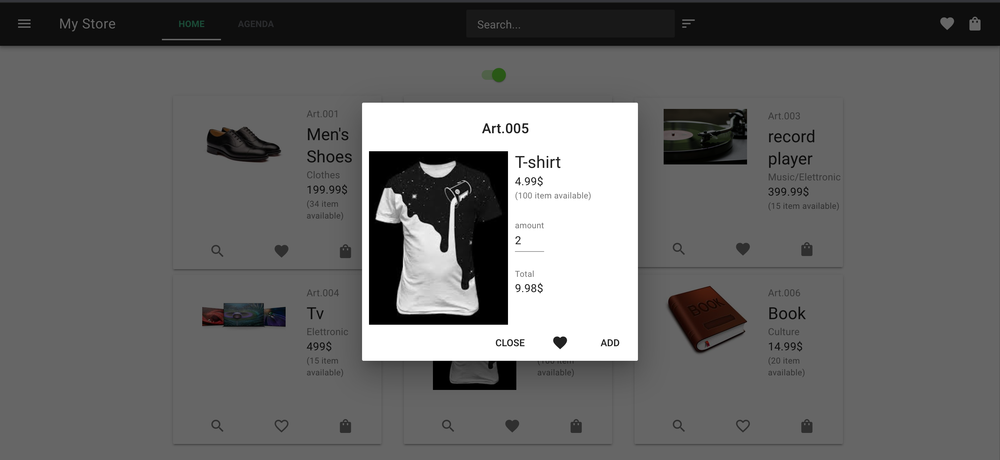
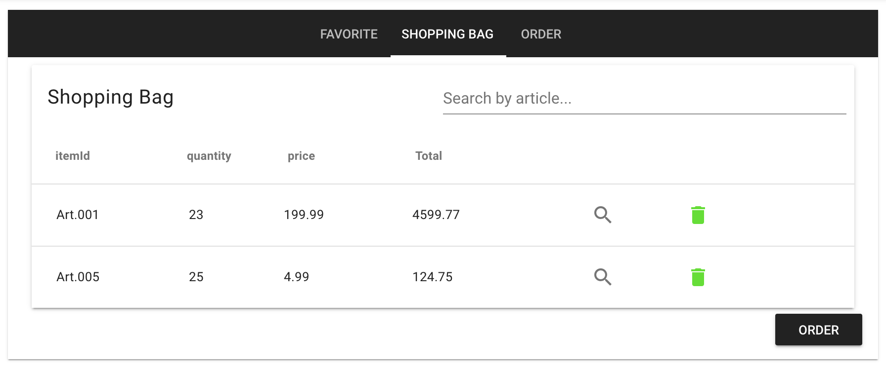

# Store Simulator

Store simulator is the simulation of a wholesale company which operate with selected customer.
The application will offer different functionality for user and store owner.
A new costumer will receive an account after submit a request.



## Project setup

The project need Postgres and Redis installed and running

Also need to setup the .env file following the .env.example file present in the project root.

set the project and run migration and user seed
```
yarn install
yarn migrate
yarn seed
```

start the server and the frontend
```
yarn start
yarn serve
```

after that the user will be able to access for the first time using the credential inserted the env file or a new account create inside the application


<!-- ## Main functionality

Manage the list of item and the users manager tab view update or remove the item and orders



Manage the item in the store in special vi -->

## Technologies used

FrontEnd:  VueJS, Vuex, Vue-Apollo, VueMaterial

Backend: Express, Apollo, Graphql, Redis, Sequelise, Postgres
